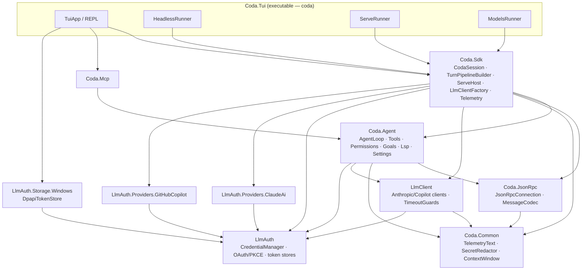
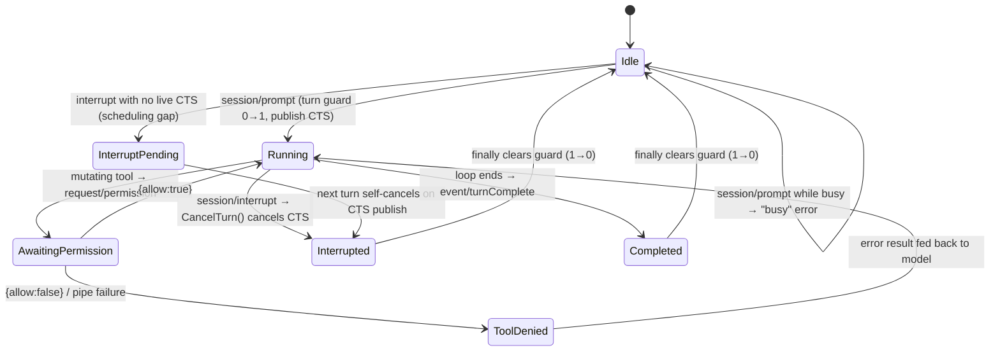

# Coda — Architecture Overview

> A standalone engineering reference for the **coda-cli** codebase: what Coda is, how
> its projects fit together, how a turn flows end-to-end (especially in `serve` mode),
> the major subsystems, and a candid assessment of the architecture's rough edges.
>
> Scope: the C# / .NET 10 solution under `src/`. Wire-protocol details live in
> [`serve-protocol.md`](serve-protocol.md); the programmatic surface in [`API.md`](API.md).
> This document complements those — it is the *internal* map, not the public contract.
>
> Verified against the `refactor/architecture-smells` branch (post-remediation: the seven
> smells this document catalogued in [§6](#6-architectural-assessment-smells) have been
> addressed). The source tree now holds **eleven** projects under `src/`.

## Table of contents

1. [High-level overview](#1-high-level-overview)
2. [Module / project map](#2-module--project-map)
3. [Control & data flow: a serve-mode turn](#3-control--data-flow-a-serve-mode-turn)
4. [Subsystems](#4-subsystems)
   - [4.1 LLM clients](#41-llm-clients)
   - [4.2 Auth & credentials](#42-auth--credentials)
   - [4.3 Settings](#43-settings)
   - [4.4 Telemetry](#44-telemetry)
   - [4.5 MCP](#45-mcp)
   - [4.6 Permissions](#46-permissions)
   - [4.7 Sessions & persistence](#47-sessions--persistence)
   - [4.8 Where the timeouts live](#48-where-the-timeouts-live)
5. [Diagrams](#5-diagrams)
6. [Architectural assessment ("smells")](#6-architectural-assessment-smells)

---

## 1. High-level overview

**Coda is a native C# / .NET 10 agentic coding assistant** — an engine that runs the
classic agentic tool-use loop (stream an assistant turn → execute the tools the model
requests, permission-gated → feed the results back → repeat until the model stops or a
bound is hit) against a pluggable set of LLM providers (Claude.ai OAuth, Anthropic API
key, GitHub Copilot).

One engine, several front-ends. The process entry point is `src/Coda.Tui/Program.cs`,
which dispatches on `args[0]`:

| Mode | Entry | Purpose |
|---|---|---|
| **interactive TUI** | `coda` (no subcommand) → `TuiApp` | human REPL with slash commands (`Program.cs` composition root) |
| **`run`** | `coda run -p "<task>"` → `HeadlessRunner` | one-shot headless / side-agent use, optional `--json` |
| **`serve`** | `coda serve` → `ServeRunner` → `ServeHost` | JSON-RPC 2.0 agent server an orchestrator drives |
| **`models`** | `coda models` → `ModelsRunner` | print the active provider's model list |
| **`help`** | `coda help [cmd]` → `HelpRunner` | credential-free command help |

All five share the same callable engine, `Coda.Sdk.CodaSession`, which wires a provider
client + tools + subagents + permission policy and runs the loop while keeping the
conversation across calls.

**How an orchestrator drives Coda (`serve`).** `coda serve` runs Coda as a **JSON-RPC
2.0 server over a duplex byte stream** (stdio by default; an authenticated local socket
when an API key is supplied). The framing is `Content-Length`-delimited JSON-RPC — the
same framing as the Language Server Protocol — and the connection is **bidirectional**:
the orchestrator sends requests (`initialize`, `session/prompt`, `session/interrupt`,
`session/history`, …), Coda streams back `event/*` notifications (assistant text, tool
calls/results, usage, turn-complete), and Coda may send **server-initiated requests**
(`request/permission`, `request/question`, `request/planApproval`) that the orchestrator
must answer mid-turn. This is the integration used by the Cortex bridge, which spawns
`coda serve` as its coding engine.

---

## 2. Module / project map

Eleven projects under `src/`, three test projects under `tests/`. All target `net10.0`.

### Responsibilities

- **`Coda.Tui`** *(executable; `PackAsTool` → the `coda` global tool)* — every
  front-end and the composition root. Owns argument dispatch (`Program.cs`), the
  interactive REPL (`TuiApp`, `Repl/`, ~40 slash `Commands/`), the headless/serve/models
  runners, plugin & skill loading, the setup wizard, and credential-store selection
  (`CredentialStoreFactory`). This is the only project that knows about Spectre.Console
  and the only one that constructs the concrete provider + DPAPI graph.

- **`Coda.Sdk`** *(library; the embeddable engine surface)* — `CodaSession` (the
  callable engine that builds the loop and holds conversation state), the `serve`
  JSON-RPC host (`Serve/ServeHost.cs` + wire DTOs + transports), `LlmClientFactory`
  (provider id → `ILlmClient`), the model catalog / pricing, session transcript
  persistence, the cron scheduler, and the **telemetry** stack
  (`Telemetry/` — logger factory, JSON-lines file sink, resolver).

- **`Coda.Agent`** *(library; the agent core)* — `AgentLoop` (the tool-use cycle),
  all built-in `Tools/`, the `ToolRegistry`, the permission model
  (`PermissionMode`, `ModePermissionPrompt`, `Permissions/`, `Classifier/`), goals &
  budgets (`Goals/`), conversation compaction (`Compaction/`), subagents & teams
  (`SubagentHost`, `Teams/`), background tasks, schedules, hooks, output styles, the
  shell executor (`ProcessShellExecutor`), settings loading (`Settings/` — including the
  `TelemetrySettings` config record), and an **LSP client** (`Lsp/` — the
  language-server-specific code; `LspClient` now builds its transport on the neutral
  `JsonRpcConnection` from `Coda.JsonRpc` rather than hosting its own framing engine).

- **`Coda.Mcp`** *(library; Model Context Protocol client)* — connects to configured
  MCP stdio servers, adapts their tools/resources/prompts into `ITool` instances
  (`McpTool`, `McpClientManager`, `McpStdioClient`).

- **`LlmClient`** *(library; provider HTTP clients)* — `ILlmClient` plus the streaming
  `AnthropicMessagesClient` and `CopilotChatClient`, the internal chat model
  (`ChatMessage`/`ContentBlock`/`ChatRequest`), SSE readers, and the HTTP-timeout guards
  (`LlmHttpTimeoutConfig` / `LlmHttpTimeoutGuards`). The shared telemetry helpers
  `TelemetryText` and `SecretRedactor` **used to live here by necessity** but have been
  promoted to the new `Coda.Common` leaf (see [§6.2](#62-shared-helpers-pulled-down-into-llmclient-by-the-dependency-direction)).

- **`Coda.Common`** *(library; the zero-dependency leaf)* — the shared primitives that
  several layers need but that depend on nothing: the telemetry helpers `TelemetryText`
  (truncation) and `SecretRedactor` (redaction), and `ContextWindow.DefaultTokens` (the
  single nominal 200,000-token context-window constant). It has **no `ProjectReference`s**,
  so both `LlmClient` and `Coda.Agent` can reference it without inverting the spine.

- **`Coda.JsonRpc`** *(library; the neutral JSON-RPC engine; deps: `Coda.Common`)* — the
  generic `Content-Length`-framed JSON-RPC 2.0 connection engine, protocol-agnostic:
  `JsonRpcConnection` / `IJsonRpcConnection` (the read-loop + request/response dispatch),
  `JsonRpcMessageCodec` (framing), and the `JsonRpcRequestException` / `JsonRpcResponseException`
  error types. Both consumers build on it — the serve host (`ServeHost`, `Coda.Sdk`) and the
  LSP client (`LspClient`, `Coda.Agent`) — so neither owns the other's framing.

- **`LlmAuth`** *(library; auth core)* — the credential façade `CredentialManager`,
  the `ICredentialProvider` / `ITokenStore` / `ILoginFlow` abstractions, the OAuth2 PKCE
  client, loopback redirect listener, device-code prompt, and `FileTokenStore` /
  `InMemoryTokenStore`. No provider- or OS-specific code.

- **`LlmAuth.Providers.ClaudeAi`** — the Claude.ai OAuth provider + `ApiKeyProvider`
  (raw Anthropic API key). Implements `ICredentialProvider` / login flow against `LlmAuth`.

- **`LlmAuth.Providers.GitHubCopilot`** — the GitHub Copilot device-code provider; does
  the **token exchange** (GitHub OAuth token → short-lived Copilot bearer) and supplies
  the editor headers.

- **`LlmAuth.Storage.Windows`** — `DpapiTokenStore`: DPAPI-encrypted (`CurrentUser`)
  `.cred` files under `~/.coda/credentials`. The only Windows-specific assembly besides
  the TUI's storage selection.

### Dependency direction

`ProjectReference` edges only (verified from the `.csproj` files):

```
Coda.Tui ──► everything (Coda.Sdk, Coda.Agent, Coda.Mcp, Coda.Common, Coda.JsonRpc, LlmClient, LlmAuth, both providers, Storage.Windows)
Coda.Sdk ──► Coda.Agent, Coda.JsonRpc, Coda.Common, LlmClient, LlmAuth, ClaudeAi, GitHubCopilot
Coda.Mcp ──► Coda.Agent
Coda.Agent ──► Coda.JsonRpc, Coda.Common, LlmClient, LlmAuth
Coda.JsonRpc ──► Coda.Common
LlmClient ──► Coda.Common, LlmAuth
ClaudeAi / GitHubCopilot / Storage.Windows ──► LlmAuth
Coda.Common ──► (nothing)
LlmAuth ──► (nothing)
```

Key facts that fall out of this graph:

- **`Coda.Sdk → Coda.Agent → LlmClient → LlmAuth`** is the spine. `LlmAuth` is a leaf;
  `LlmClient` sits just above it; `Coda.Agent` is the agent core; `Coda.Sdk` is the
  *composition layer* that assembles the engine. Despite the "Sdk vs Agent" naming, **Sdk
  is the higher-level project that depends on Agent**, not vice-versa.
- **There are now two leaves: `LlmAuth` and `Coda.Common`** — both depend on nothing.
  `Coda.Common` is the neutral home that the smell remediation introduced for primitives
  several layers share (`TelemetryText`, `SecretRedactor`, `ContextWindow.DefaultTokens`).
  Because it is below both `LlmClient` and `Coda.Agent`, those two can share it without
  inverting the spine — which is why those helpers no longer have to sit awkwardly in
  `LlmClient` (see [§6.2](#62-shared-helpers-pulled-down-into-llmclient-by-the-dependency-direction)).
- **`Coda.JsonRpc` (→ `Coda.Common`) is a second small leaf-ish project** holding the generic
  JSON-RPC framing/dispatch engine. Both the serve host (`Coda.Sdk`) and the LSP client
  (`Coda.Agent`) reference it, so the serve protocol no longer borrows the LSP client's
  transport (see [§6.4](#64-the-serve-json-rpc-engine-is-the-lsp-client-engine)).
- **No cycles.** The one place that *looks* circular — `CodaSession` (Sdk) needs the
  agent loop, and the loop's compaction/goal helpers need an `ILlmClient` — is resolved
  by passing the client *into* the loop as a constructor argument, so the dependency
  stays one-directional at the project level.

---

## 3. Control & data flow: a serve-mode turn

This is the end-to-end path for one orchestrator-driven prompt. File references are to the
exact handlers.

### Startup & handshake

1. `coda serve` → `ServeRunner.RunAsync` (`src/Coda.Tui/ServeRunner.cs`). Parses options
   (provider/model resolved with `~/.coda/settings.json` defaults as a fallback under
   `CODA_SETTINGS_DIR`), builds the `CredentialManager` over the **DPAPI** store and the
   three providers, loads the settings telemetry block, and selects the transport: an API
   key ⇒ `LocalSocketServeTransport` (authenticated), otherwise `StdioServeTransport`.
2. `ServeHost.RunAsync` (`src/Coda.Sdk/Serve/ServeHost.cs`) constructs the JSON-RPC
   connection **with its read loop deferred** (`new JsonRpcConnection(input, output,
   startListening: false)` — the neutral engine from `Coda.JsonRpc`), builds the (slow,
   ~seconds) `CodaSession`, registers all
   request handlers, and only **then** calls `connection.Start()`. This ordering closes a
   startup race where the orchestrator's immediately-sent `initialize` could otherwise
   arrive before any handler exists and be answered with `-32601 Method not found`
   (`ServeHost.cs:61-80`).
3. `initialize` validates the API key (constant-time SHA-256 compare), optionally resumes a
   persisted transcript, and returns `{ protocolVersion, sessionId, serverInfo,
   telemetryLogPath }` — the telemetry path lets the orchestrator tail the log
   (`ServeHost.cs:167-200`).

### A `session/prompt` turn

4. `session/prompt` handler (`ServeHost.cs:203`) validates & decodes any images **before**
   taking the turn guard, then `Interlocked.CompareExchange` enforces **one turn at a
   time**. A linked `CancellationTokenSource` (client token + host token) is published
   under `turnLock`, honoring any interrupt that raced in during the publish window
   (`interruptPending`).
5. A `WireAgentSink` (`src/Coda.Sdk/Serve/WireAgentSink.cs`) is created; it forwards every
   agent event as a fire-and-forget JSON-RPC notification (a dead pipe never crashes the
   agent). The handler calls `CodaSession.RunAsync(text|content, sink, cts.Token)`.
6. `CodaSession.RunAsync` (`src/Coda.Sdk/CodaSession.cs:288`) snapshots options and creates the
   provider client via the injected `ILlmClientFactory`, then delegates the per-turn assembly
   to `TurnPipelineBuilder.BuildSpec(...)` (`src/Coda.Sdk/Turns/TurnPipelineBuilder.cs`) — which
   builds the system prompt, permission prompt (mode-based, optionally rules-wrapped and/or
   classifier-escalated), the goal supervisor (if a goal is set), and the tool registries into
   an `AgentLoopSpec`. The injected `IAgentLoopFactory` turns that spec into a ready `AgentLoop`.
   `RunAsync` then appends the user message and runs the loop. On any failure it **rolls history
   back to the pre-turn snapshot** so the conversation never corrupts, and returns a structured
   `RunResult`. (Both factories default to concrete implementations, so production behavior is
   unchanged; the seams exist so `RunAsync` can be unit-tested against fakes — see
   [§6.7](#67-test-seams-are-uneven).)
7. `AgentLoop.RunAsync` (`src/Coda.Agent/AgentLoop.cs:101`) iterates:
   - Builds a `ChatRequest` and **streams** it via `client.StreamAsync(...)`. Text deltas
     are pushed to the sink as they arrive (`OnAssistantText`); tool-use blocks accumulate.
   - When the model requests tools, `RunToolsAsync` (`AgentLoop.cs:403`) runs each:
     user `PreToolUse` hooks → permission gate (skipped for read-only tools) → `ExecuteAsync`
     → `PostToolUse` hooks → result block. Tool errors are caught and returned as error
     results (the turn continues); only `OperationCanceledException` propagates.
   - Results are appended to history and the loop repeats; LSP diagnostics, team-inbox
     messages, and deferred-tool reminders are injected between iterations as synthetic
     user messages.
8. **Tool execution example — `run_command`.** `RunCommandTool` (`src/Coda.Agent/Tools/
   RunCommandTool.cs`) resolves its timeout (default 10 min, `CODA_RUN_COMMAND_TIMEOUT`
   override) and delegates to `ProcessShellExecutor` (`src/Coda.Agent/ProcessShellExecutor.cs`),
   which starts PowerShell/bash, **immediately closes the child's stdin** (the fix for the
   serve-mode deadlock: in serve, the process's own stdin is the never-EOF JSON-RPC pipe, so
   a child inheriting it would block forever), reads stdout/stderr concurrently under the
   timeout token, and on *any* abnormal exit kills the **entire process tree** before
   propagating.
9. **Events stream back.** Throughout, `WireAgentSink` emits `event/assistantText`,
   `event/toolCall`, `event/toolResult`, `event/usage`, `event/stop`. When the loop
   completes, `ServeHost` surfaces failure reasons (`event/error` + stderr +
   `PromptResult.Error`), emits `event/turnComplete`, and resolves the `session/prompt`
   response with `{ ok, stopReason?, interrupted, goalStatus? }`.

### Interrupt & permission

- `session/interrupt` → `ServeHost.CancelTurn()` cancels the live turn's CTS, which reaches
  the in-flight `HttpClient.SendAsync` and unwinds the loop. If no turn CTS is published yet
  (the scheduling gap), the interrupt is **deferred** (`interruptPending`) so it is never
  lost (`ServeHost.cs:524-553`).
- A non-read-only tool triggers `WirePermissionPrompt.RequestAsync`
  (`src/Coda.Sdk/Serve/WirePermissionPrompt.cs`), which sends a `request/permission`
  server-initiated request and blocks the tool on the orchestrator's reply (deny on any
  failure). Questions and plan approval work the same way (`WireUserQuestionPrompt`,
  `WirePlanApprover`).

### Where the timeouts are (and aren't)

The `session/prompt` handler has **no turn-level inactivity watchdog** — and that is
deliberate, documented in code at `ServeHost.cs:263-267`. A hung LLM call is bounded
*inside the LLM client* by HTTP-layer guards; a hung command is bounded *inside the tool*.
The orchestrator owns the outer session-level bound. See [§4.8](#48-where-the-timeouts-live).

---

## 4. Subsystems

### 4.1 LLM clients

`LlmClient` exposes `ILlmClient` (streaming `StreamAsync`, `CountTokensAsync`,
`ListModelsAsync`). Two implementations:

- **`AnthropicMessagesClient`** — Anthropic Messages API (`/v1/messages`, `stream: true`),
  used by both the Claude.ai OAuth provider and the raw API-key provider. Attaches the
  client fingerprint + auth headers, gates reasoning effort behind a beta header, serializes
  the system prompt as a cache-controlled text block, and yields events via
  `AnthropicSseReader`. Also implements `/v1/messages/count_tokens` (for `/context`) and the
  cursor-paginated `GET /v1/models`.
- **`CopilotChatClient`** — GitHub Copilot's OpenAI-shaped `/chat/completions`. Translates
  the internal chat model to/from OpenAI shape (`OpenAiRequest` / `OpenAiSseReader`) and uses
  the Copilot bearer + editor headers from `CredentialManager`.

Both clients construct their own `HttpClient` with `Timeout = Timeout.InfiniteTimeSpan`
when one is not supplied (so a long-but-healthy stream is never capped) and bound hung calls
with the shared HTTP-timeout guards. Both do **full-mode trace logging** (see §4.4):
request preview (model, message/tool counts, redacted+truncated system & last-user text),
redacted+truncated request body, and a response preview (content, stop reason, tokens,
latency) — all gated on `IsEnabled(LogLevel.Trace)`.

### 4.2 Auth & credentials

`CredentialManager` (`src/LlmAuth/CredentialManager.cs`) is the façade: registers providers,
drives interactive login (OAuth loopback **and** device-code), loads/persists credentials,
**auto-refreshes on read with per-provider coalescing** (a `SemaphoreSlim` per provider id,
re-reading inside the lock to avoid duplicate refreshes), and produces auth headers
(`GetAuthHeadersAsync`).

- **Providers** plug in via `ICredentialProvider`: Claude.ai (OAuth PKCE loopback),
  Anthropic API key (`ApiKeyProvider`), GitHub Copilot (device code + **token exchange**:
  the stored GitHub token is exchanged for a short-lived Copilot bearer that
  `NeedsRefresh`/`RefreshAsync` keep current).
- **Storage** is an `ITokenStore`. The Windows default is `DpapiTokenStore`: each credential
  is JSON-serialized and **DPAPI-encrypted (`CurrentUser`)** into a `<key>.cred` file under
  `~/.coda/credentials` (key form `llmauth:<providerId>`). Only the current Windows user can
  decrypt it; no secrets touch the settings files. `CredentialStoreFactory` (TUI) selects the
  store. `coda serve` is **Windows-only** (`ServeRunner` returns 1 elsewhere) because of this.

### 4.3 Settings

`SettingsLoader.Load` (`src/Coda.Agent/Settings/SettingsLoader.cs`) merges **user** settings
(`<home>/.coda/settings.json`) with **project** settings (`<cwd>/.coda/settings.json`).
The home root is `CODA_SETTINGS_DIR` when set, else the user profile — this is what lets the
serve path (and tests) redirect settings hermetically. Merge rules: list fields (allow / deny
/ hooks) concatenate user-then-project; LSP servers overlay by name; `defaultProvider` /
`defaultModel` / telemetry are project-overrides-user; goal settings merge field-by-field.
Missing or corrupt files are silently treated as empty (`CodaSettings.Empty`).

`CodaSettings` carries permissions, hooks, LSP servers, provider/model defaults, the goal
block, and the telemetry block. **Serve defaults** (provider/model when no `--provider`/
`--model` flag) come from the SAME `SettingsLoader.Load(...).DefaultProvider`/`.DefaultModel`
the TUI uses (merged user + project, project-over-user, honoring `CODA_SETTINGS_DIR`), falling
back to the built-in provider default. Runtime mutation of the goal happens via `session/setGoal`,
which rewrites `CodaSession.Options` (a `volatile` record snapshotted per turn).

### 4.4 Telemetry

Opt-in structured logging built on `Microsoft.Extensions.Logging` with a custom JSON-lines
file provider. `TelemetrySettings` (in `Coda.Agent/Settings/`) is the config record; the
serve `--telemetry` flag forces it on per-session via `SessionOptions.TelemetryOverride`
without ever mutating the on-disk file.

- **Resolution** (`Coda.Sdk/Telemetry/TelemetryResolver.cs`): settings block → env overrides
  (`CODA_LOG_LEVEL` / `CODA_LOG_STDERR` / `CODA_LOG_FILE`) layered on top. The serve `--telemetry`
  force-on path (incl. the `--telemetry-level off` special case) is the single authority
  `TelemetryResolver.ResolveServeOverride` — serve passes its flags through it rather than
  re-implementing the layering.
- **Factory** (`CodaLoggerFactory.Create`): when enabled, prunes old run files and wires a
  `JsonLinesFileLoggerProvider` (one redacted JSON object per line into `~/.coda/logs`),
  optionally echoed to stderr; when disabled, returns `NullLoggerFactory` (zero cost).
- **Levels**: `info` = lifecycle (session start, request start); `debug` = turn
  start/end, tool start/done; `trace` = **full mode** — the LLM request/response previews
  and bodies described in §4.1, plus per-command stdout/stderr previews from
  `ProcessShellExecutor`. Every field is **redacted then truncated** using the `Coda.Common`
  helpers: `SecretRedactor.Redact`/`RedactJson` strips bearer/`sk-` tokens and known secret
  JSON keys/headers, and `TelemetryText.Truncate` caps each preview (default 500 chars,
  `CODA_TELEMETRY_TRUNCATE`) so one log line can't balloon. The `JsonLinesFileLogger` redacts
  again at the sink (incl.
  exception messages/stacks) as a backstop, and never throws into its caller.

### 4.5 MCP

`Coda.Mcp` connects to MCP stdio servers declared in `.mcp.json` (`McpConfig` / `McpServerConfig`),
manages them with `McpClientManager` over `McpStdioClient` + `McpRpcConnection`, and adapts each
server tool into an `McpTool` (an `ITool`, namespaced `mcp__<server>__<tool>`). Resource and
prompt access are exposed as additional tools (`ListMcpResourcesTool`, `ReadMcpResourceTool`,
`ListMcpPromptsTool`, `GetMcpPromptTool`). MCP is wired in the **TUI** composition root; the
serve/headless paths use the built-in tool set unless extra tools are injected.

### 4.6 Permissions

The model is layered (`Coda.Agent`):

- **`PermissionMode`** — `Default` (mutating tools prompt), `AcceptEdits`, `Plan`,
  `BypassPermissions` (yolo).
- **`ModePermissionPrompt`** turns the mode into allow/prompt decisions; read-only tools
  (`ITool.IsReadOnly`) never prompt.
- **`RulesPermissionPrompt`** wraps the base prompt when `allow`/`deny` rules exist in
  settings (parsed `PermissionRule` patterns).
- **`ClassifierPermissionPrompt`** (yolo-safe) routes each mutating action through an LLM
  `LlmToolActionClassifier` that escalates risky actions back to an interactive prompt.

In serve mode the "interactive prompt" is `WirePermissionPrompt` (server-initiated
`request/permission`); plan approval and clarifying questions follow the same wire pattern.

### 4.7 Sessions & persistence

`CodaSession` is the engine instance: it holds the conversation `history`, accumulated token
usage, the todo/schedule/background-task/team stores, the optional LSP manager, and the
telemetry logger. It is both `IDisposable` and `IAsyncDisposable`; **serve uses the async
path** and `ServeHost` awaits `DisposeAsync` (cancel-first teardown — cancel the turn, await
session disposal, dispose the connection last) so a turn-running session never leaks across
the host's lifetime.

Transcripts persist after each successful turn (`SessionTranscriptStore`, under
`<cwd>/.coda`), keyed by `SessionId`, enabling `initialize { sessionId }` to resume a
conversation in a fresh process.

### 4.8 Where the timeouts live

This is the architecture's load-bearing reliability decision, so it gets its own table.
The guiding principle: **a timeout belongs at the layer of the operation it guards.**

| Concern | Bound by | Where | Default / override |
|---|---|---|---|
| LLM response headers never arrive | `ResponseHeadersTimeout` | `LlmHttpTimeoutGuards.SendWithHeadersTimeoutAsync` | 100s / `CODA_LLM_RESPONSE_HEADERS_TIMEOUT` |
| LLM stream stalls mid-response | `StreamIdleTimeout` (reset per chunk) | `LlmHttpTimeoutGuards.WithStreamIdleTimeout` | 60s / `CODA_LLM_STREAM_IDLE_TIMEOUT` |
| Total stream duration | **intentionally unbounded** | `HttpClient.Timeout = InfiniteTimeSpan` (clients & `CodaSession`) | n/a (capping it would kill a long, healthy answer) |
| A shell command hangs | command timeout | `RunCommandTool` → `ProcessShellExecutor` (timeout CTS) | 10 min / `CODA_RUN_COMMAND_TIMEOUT` |
| Turn-level inactivity | **no watchdog** | removed; see `ServeHost.cs:263-267` | the orchestrator owns the outer bound |
| Session/LSP teardown | 5s bounded dispose | `CodaSession.DisposeAsync`, `ServeHost` | fixed |

The **turn-level inactivity watchdog was deliberately removed** in favor of the per-chunk
idle guard inside the client. The old watchdog lived at the wrong layer: it couldn't tell a
genuinely-progressing-but-slow turn from a true stall, so it risked truncating healthy long
turns. Pushing the bound down to where the bytes actually flow (the HTTP stream) fixed that —
a chunk resets the idle clock, so only real silence trips it. This is a textbook case of
*moving a timeout from a coarse outer layer to the operation it actually guards.*

---

## 5. Diagrams

### 5.1 Component / dependency diagram



### 5.2 Sequence: a serve-mode prompt turn (with a tool call + LLM round-trip)

```mermaid
sequenceDiagram
    participant O as Orchestrator
    participant SH as ServeHost
    participant CS as CodaSession
    participant AL as AgentLoop
    participant LC as LlmClient (Anthropic/Copilot)
    participant T as RunCommandTool / ProcessShellExecutor

    O->>SH: initialize {apiKey, sessionId?}
    SH-->>O: {protocolVersion, sessionId, telemetryLogPath}

    O->>SH: session/prompt {text}
    Note over SH: take turn guard · publish linked CTS
    SH->>CS: RunAsync(text, WireAgentSink, ct)
    CS->>AL: RunAsync(history, sink, ct)

    AL->>LC: StreamAsync(ChatRequest)
    LC-->>AL: text deltas + tool_use (SSE, idle-timeout guarded)
    AL-->>SH: OnAssistantText / OnToolCall
    SH-->>O: event/assistantText, event/toolCall

    Note over AL: tool is mutating → permission gate
    AL->>SH: request/permission (via WirePermissionPrompt)
    SH->>O: request/permission {tool, input}
    O-->>SH: {allow: true}
    SH-->>AL: allowed

    AL->>T: ExecuteAsync (stdin closed; tree-kill on abend; 10m timeout)
    T-->>AL: ShellResult (exit, stdout/stderr)
    AL-->>SH: OnToolResult
    SH-->>O: event/toolResult

    AL->>LC: StreamAsync (results fed back)
    LC-->>AL: final text + stop_reason
    AL-->>SH: OnAssistantTextComplete / OnUsage / OnStopReason
    SH-->>O: event/usage, event/stop

    Note over CS: persist transcript · accumulate usage
    CS-->>SH: RunResult {success, stopReason}
    SH-->>O: event/turnComplete
    SH-->>O: session/prompt result {ok, stopReason}
```

### 5.3 State / flow: permission & interrupt handling



---

## 6. Architectural assessment ("smells")

Honest and code-grounded. Each item: *what it is*, *why it's a problem*, *a direction*.
Items are ordered roughly by impact. Several of these are mild; the codebase is, on the
whole, carefully written (extensive guard comments, real concurrency hygiene, thorough
redaction). The recent reliability work (timeout placement, stdin/deadlock, tree-kill,
startup race) is a genuine *improvement* in layering, not a regression.

> **Status (this branch).** Every smell below has been worked on the
> `refactor/architecture-smells` branch; each item now carries a **Resolution** line. In
> short: 6.2 / 6.3 / 6.4 / 6.6 / 6.7 are **resolved**, 6.5 is **addressed** (best-effort
> swallows now logged where a logger is reachable), and 6.1 is **largely resolved** —
> decomposed + seam-ed, with per-turn caching *deliberately* skipped (see 6.1). The
> original *what / why* descriptions are kept for context; the Resolution lines record what
> changed.

### 6.1 `CodaSession` is a god-object / composition god-method

- **What.** `CodaSession` is the largest file in the repo (749 lines) and `RunAsync`
  (`CodaSession.cs:249-413`) single-handedly builds the provider client, system prompt,
  output style, permission stack (mode → rules → classifier), goal supervisor + budget,
  hooks, four separate tool registries (subagent, parent, LSP-conditional, team,
  tool-search), the `AgentLoop`, *and* performs pre-turn auto-compaction — on **every
  turn**. The constructor (`CodaSession.cs:51-163`) separately builds LSP, teams, and the
  tool-search coordinator.
- **Why it's a problem.** The per-turn assembly is hard to test in isolation, re-allocates
  the entire tool/permission graph each turn, and concentrates change-risk: nearly every
  feature (goals, teams, LSP, tool-search, classifier) has a tendril here. It is the single
  place most likely to grow without bound.
- **Direction.** Extract a `TurnPipelineBuilder` (or per-turn `AgentLoopFactory`) that takes
  a snapshot of `SessionOptions` and returns a ready `AgentLoop`; cache the stable parts
  (tool registries, system-prompt inputs) and rebuild only what options actually changed.
- **Resolution — largely resolved.** The per-turn assembly was lifted out of `RunAsync` into
  a dedicated `TurnPipelineBuilder` (`src/Coda.Sdk/Turns/TurnPipelineBuilder.cs`) that returns
  an `AgentLoopSpec` (`src/Coda.Sdk/AgentLoopSpec.cs`), which the injected `IAgentLoopFactory`
  turns into a ready `AgentLoop`. `CodaSession` now receives its heavy collaborators through
  the `ILlmClientFactory` + `IAgentLoopFactory` seams (default-concrete), so the constructor no
  longer hard-wires the whole graph. The file shrank from 749 to ~664 lines and `RunAsync` is
  now mostly orchestration. **Per-turn caching was deliberately *not* done** (was Task 11,
  skipped by design): the one worthwhile target — the system prompt — *cannot* be cached
  without breaking behavior, because it folds in `ProjectContext` read from disk each turn, so
  live `CLAUDE.md`/project-settings edits must keep being picked up; the only other cacheable
  parts (the two tool registries) are a negligible per-turn cost and caching them would add
  invalidation complexity for no real gain. So this is "decomposed + seam-ed," not "memoized" —
  and that is the honest, correct trade-off.

### 6.2 Shared helpers pulled down into `LlmClient` by the dependency direction

- **What.** `TelemetryText` (truncation) and `SecretRedactor` (redaction) live in
  `LlmClient` (`src/LlmClient/`), and their own doc-comments admit it's a placement of
  convenience: "Lives in `LlmClient` … because both the LLM clients here and the agent tools
  in `Coda.Agent` depend on this project — it is the lowest common project both can
  reference without inverting the dependency direction." `TelemetrySettings`, by contrast,
  lives in `Coda.Agent/Settings/` (because `CodaSettings` references it), and the telemetry
  *sink* lives in `Coda.Sdk/Telemetry/`. So one cohesive concern — telemetry — is smeared
  across three projects because of where each piece's dependents happen to sit.
- **Why it's a problem.** Concept cohesion lost to mechanical dependency constraints:
  "redaction" being in the *HTTP client* project is surprising, and a newcomer has to learn
  the dependency graph to find each telemetry piece. It also means `LlmClient` carries
  string-formatting/regex utilities unrelated to talking to an LLM.
- **Direction.** Introduce a tiny leaf `Coda.Common` (or `Coda.Diagnostics`) project that
  both `LlmClient` and `Coda.Agent` reference, and move `TelemetryText` + `SecretRedactor`
  (and arguably `TelemetrySettings`) there. The spine already allows it — `LlmAuth` is a
  leaf today, and a second leaf is cheap.
- **Resolution — resolved.** A zero-dependency `Coda.Common` leaf now exists and hosts
  `TelemetryText` and `SecretRedactor` (plus `ContextWindow.DefaultTokens`); `LlmClient` and
  `Coda.Agent` both reference it, so "redaction" no longer lives in the HTTP-client project.
  `TelemetrySettings` **deliberately stayed** in `Coda.Agent/Settings/` — it is a config record
  cohesive with `CodaSettings` (which references it), so moving it would have split *that*
  cohesion to chase the telemetry-naming one. The telemetry *sink* remains in `Coda.Sdk` for
  the same dependents-driven reason; that residual spread is intentional and small.

### 6.3 Provider-token & default-model resolution duplicated across front-ends

- **What.** The `provider token → providerId` switch (`"claude"/"copilot"/"apikey"/…`)
  is copy-pasted in **four** front-end runners: `Program.cs` (`ResolveStartupProviderId`),
  `ServeRunner.cs` (`ResolveProviderId`), `HeadlessRunner.cs`, and `ModelsRunner.cs`.
  `DefaultModelFor` (provider → default model) is likewise duplicated. The nominal
  **200,000-token context window** is hardcoded in three places (`CodaSession.cs:148`,
  `CodaSession.cs:429`, `ToolSearchCoordinator` default).
- **Why it's a problem.** Adding a provider or changing an alias means editing four files
  in lockstep; they *will* drift (the two `Resolve*` copies already differ slightly in
  formatting). The 200k constant is a latent inconsistency for non-200k-window models.
- **Direction.** A single `ProviderAliases.Resolve(token)` + `ProviderDefaults.ModelFor(id)`
  in `Coda.Sdk` (or the suggested common project), called by all front-ends. Fold the
  context-window default behind one `const`.
- **Resolution — resolved.** `ProviderAliases.Resolve(token)` and `ProviderDefaults.ModelFor(id)`
  now live in `src/Coda.Sdk/Providers/`, and all four front-ends (`Program.cs`, `ServeRunner.cs`,
  `HeadlessRunner.cs`, `ModelsRunner.cs`) call them — the duplicated copies are gone. Unifying
  the copies surfaced and **fixed a latent `.Trim()` drift** (one copy trimmed the token, the
  others didn't, so otherwise-equal inputs could resolve differently). The 200,000-token window
  is now the single `Coda.Common.ContextWindow.DefaultTokens`, referenced from `CodaSession`
  (`ContextWindowTokens`/`ResolveContextWindow`) and `ToolSearchCoordinator`.

### 6.4 The serve JSON-RPC engine is the LSP *client* engine

- **What (was).** `ServeHost` (`Coda.Sdk`) drove its JSON-RPC 2.0 protocol through
  `LspConnection` / `LspMessageCodec` / `JsonRpcRequestException`, which lived in
  `Coda.Agent/Lsp/` and were built as the **client** for talking to language servers. So the
  serve *server* protocol borrowed the LSP *client* transport.
- **Why it was a problem.** Naming/ownership confusion (`ServeHost` constructing an object
  called `LspConnection` read oddly), and the two consumers could impose conflicting
  requirements on one class. The `startListening` ctor flag *exists only for the serve startup
  race* — an LSP-client class carrying a serve-host concern is exactly the coupling to avoid.
- **Why it was also defensible.** The framing genuinely is identical (Content-Length JSON-RPC),
  and reuse avoided a second framing implementation — so this was a "watch it" smell, and the
  fix is a promotion rather than a rewrite.
- **Resolution — resolved.** The framing + dispatch core was promoted to the neutral
  `Coda.JsonRpc` project: `LspConnection → JsonRpcConnection` (+ `IJsonRpcConnection`),
  `LspMessageCodec → JsonRpcMessageCodec`, and the `JsonRpcRequestException` /
  `JsonRpcResponseException` error types. Both consumers now build on it — `ServeHost`
  (`Coda.Sdk`) constructs a `JsonRpcConnection` (still with `startListening: false` to close the
  startup race, but now on a neutrally-named type), and `LspClient` (`Coda.Agent/Lsp`) builds its
  transport on the same engine while keeping the LSP-specific code (`textDocument/*` handling,
  diagnostics) in `Coda.Agent/Lsp`. The startup-race note in [§3](#startup--handshake) now
  references the neutral `JsonRpcConnection`.

### 6.5 Pervasive catch-all error swallowing

- **What.** Empty/`/* ignore */` catch blocks are everywhere by design: `WireAgentSink`
  (dead pipe), `ProcessShellExecutor` kill, `JsonRpcConnection` dispatch (`I1`/`I5` guards),
  `PersistTranscriptAsync`, `CodaSession.Dispose`, MCP/LSP teardown, the models background
  refresh, `JsonLinesFileLogger`. Most are correct ("a logger must never crash its caller").
- **Why it's a problem.** The *aggregate* makes failures invisible: when something genuinely
  breaks (a transcript that never saves, a tool whose result was dropped), there's no signal
  unless trace telemetry happens to be on. The `catch { }` density also makes it hard to tell
  load-bearing swallows from lazy ones.
- **Direction.** Route best-effort failures through the telemetry logger at `Debug`/`Warning`
  (the sink itself already can't throw), so "swallowed" still means "recorded." Reserve bare
  `catch {}` for the few truly unobservable paths (the sink, the dead-pipe notifier).
- **Resolution — addressed.** A catch-by-catch audit (37 true best-effort swallows out of 244
  catch blocks) drove the fix: every swallow *where a logger is reachable* now logs at `Debug`
  via the telemetry stack (source-generated `[LoggerMessage]`), so a swallowed failure is still
  recorded — e.g. transcript-persist, schedule-store, LSP passive feedback, skill loading, and
  the `CodaSession`/`AgentLoop` best-effort paths. Swallows with **no logger to route to** (the
  unobservable leaves) were left as commented best-effort catches, and **bare `catch {}` is now
  reserved for exactly the two genuinely-unobservable paths**: the sink itself
  (`JsonLinesFileLogger`, which must never throw into its caller) and the dead-pipe notifier
  (`WireAgentSink`). The aggregate is no longer silent where it can afford not to be.

### 6.6 Settings / serve-defaults parsing spread thin

- **What (was).** Settings parsing was split: `SettingsLoader` parsed most of `settings.json`,
  but `ServeUserDefaults.Read` *re-read the same file* for the provider/model defaults on the
  serve path, and `ServeRunner.BuildTelemetryOverride` re-implemented telemetry layering that
  partly overlapped `TelemetryResolver`. The telemetry `--telemetry-level off` special-case was
  encoded in two places (resolver `IsOff` + serve override).
- **Why it was a problem.** Two readers of one file can diverge on precedence; the serve path's
  defaults didn't necessarily match the TUI's for edge cases (serve was USER-only, the TUI was
  merged user + project). It's the classic "config read in more than one place" trap.
- **Direction.** Make `SettingsLoader` the single parse authority and fold serve's telemetry
  layering back into `TelemetryResolver`.
- **Resolution — resolved.** `ServeRunner.Parse` now consumes `SettingsLoader.Load(...).DefaultProvider`/
  `.DefaultModel` — the same merged source the TUI uses (serve now also honors PROJECT
  `settings.json` defaults, not just user). `ServeUserDefaults` was **deleted**. The serve
  force-on telemetry layering (incl. the `--telemetry-level off` special case) folded into the
  single authority `TelemetryResolver.ResolveServeOverride`; serve passes its `--telemetry`/
  `--telemetry-level` inputs through it rather than re-implementing layering. There is now one
  *kind* of settings reader, though the serve path still calls `SettingsLoader.Load` more than
  once across `ServeRunner.Parse` and the per-turn `CodaSession.RunAsync` (it re-reads to pick
  up live edits, and the merge is deterministic, so the readers agree) — collapsing those reads
  to a single startup load is a remaining, lower-value cleanup.

### 6.7 Test seams are uneven

- **What.** Some boundaries are beautifully seam-ed: `ServeRunner.Parse`/`BuildHost`/
  `BuildSessionOptions` exist purely for hermetic tests; `SettingsLoader` takes a
  `userSettingsDir`; the timeout guards are static and pure. But the engine's hot path
  (`CodaSession.RunAsync`) constructs concrete collaborators (`LlmClientFactory.Create`,
  `new AgentLoop(...)`, `new SubagentHost(...)`) directly, so it can only be tested with a
  real provider client or not at all — the unit tests concentrate in `Coda.Agent`
  (`AgentLoop`, tools) and `LlmAuth`, with `CodaSession` itself thinly covered.
- **Why it's a problem.** The most behavior-dense class is the least unit-testable; coverage
  is shaped by what happens to be injectable rather than by risk.
- **Direction.** The §6.1 pipeline extraction also buys the seam: inject an
  `IAgentLoopFactory` / `ILlmClientFactory` into `CodaSession` so a turn can be exercised
  against a fake loop/client.
- **Resolution — resolved.** `CodaSession` now takes optional `ILlmClientFactory` +
  `IAgentLoopFactory` constructor parameters (defaulting to the concrete
  `DefaultLlmClientFactory` / `DefaultAgentLoopFactory`, so production wiring is unchanged).
  With those seams a turn can run against a fake client and a fake loop, and `RunAsync` is now
  directly unit-tested (`tests/Engine.Tests/Sdk/CodaSessionRunAsyncTests.cs`, plus
  `CodaSessionClientFactoryTests` / `CodaSessionLoopFactoryTests`) — including the
  history-rollback-on-failure and `OperationCanceledException` contracts that were previously
  only reachable through a live provider. Coverage is now shaped by risk, not by what happened
  to be injectable.

### Not smells (called out to avoid false positives)

- **`Coda.Sdk → Coda.Agent` direction** is *correct*, not inverted — Sdk is the composition
  layer; the "Sdk/Agent" naming is just slightly counter-intuitive.
- **`HttpClient.Timeout = InfiniteTimeSpan`** looks alarming but is deliberate and right;
  the real bounds are the per-call header + per-chunk idle guards (§4.8).
- **The removed turn-level watchdog** is an *improvement* — the timeout now sits at the layer
  it guards. It is listed here only as the canonical example of getting layering right.
